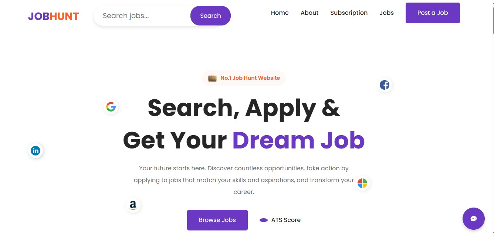
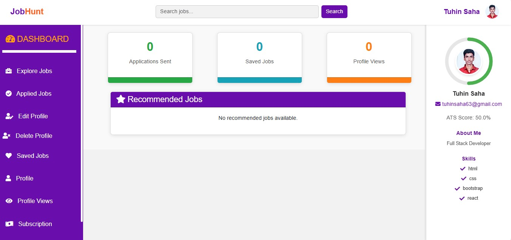

# 🌟 Django Job Portal

A modern, full-featured **Job Portal Web Application** built with **Django**, designed for **job seekers** and **recruiters**.  
It allows users to search jobs, apply, track applications, manage profiles, and view **ATS score–based recommendations**, all in a clean and intuitive UI.

---

## 🧠 Project Highlights

- **Real-world Django architecture**: Models, Views, Templates, Auth, User Roles  
- **Pixel-perfect modern UI**: Home Page, Login, Dashboard  
- **ATS-based job recommendations**  
- **Secure authentication system**  
- **Profile & skills-based matching**  
- **Job application workflow**  
- **Dashboard analytics for job seekers**

---

## ✨ UI Screenshots

### 🏠 Home Page
Modern, clean, and engaging landing page. Helps users quickly explore jobs and check ATS score.  

  

### 🔐 Login Page
Secure login system for applicants with username/password authentication.  

  

### 📊 Dashboard
Personalized dashboard showing application analytics, saved jobs, profile views, and ATS-based recommendations.  

  

---

## 🚀 Features

### 👤 User Features
- Create account, login, logout  
- Update profile, skills, resume, experience  
- ATS Score calculation  
- Personalized job recommendations  
- Apply to jobs & track status  
- Save favorite jobs  
- View applied jobs history  

### 🛠️ Admin / Recruiter Features
- Add, edit, delete jobs  
- View applicants  
- Manage job categories  
- Post jobs for users to apply  

### 💡 Technical Highlights
- Django Authentication with custom user model  
- Clean folder structure (`users`, `jobs`, `dashboard` apps)  
- Bootstrap / HTML / CSS frontend  
- ORM-based queries  
- ATS scoring logic included  
- Fully responsive UI  

---

## 📂 Project Structure

